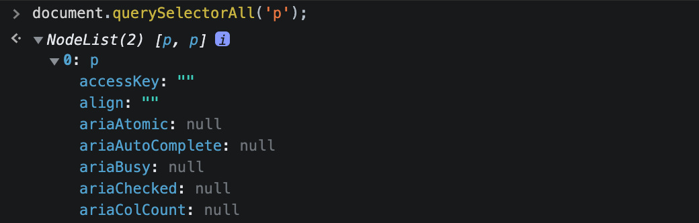

# 문서 객체 모델 (DOM)

---

Document Object Model의 약자로, document는 html를 가리킨다. 브라우저는 html 문서를 javascript가 이해할 수 있는 object로 파싱하는데, 이때 생성된 객체를 DOM이라고 한다.

즉, javascript를 사용해서 DOM에 접근하고 이벤트 처리 및 조작하는 것이 DOM의 주목적이다.

> css도 동일한 개념으로 파싱하여 CSSOM이 생성된다.

## DOM의 구성 요소

### node

html의 모든 element와 text는 node로 변환되며, 주석 또한 node로 변환된다! 브라우저는 html를 파싱하면서 트리 구조의 node로 변환시킨다. 따라서 모든 node는 서로 부모, 자식 혹은 형제 관계로 연결되어 있다. 예를 들어, html 문서가 아래와 같다면 노드 구조는 다음과 같을 것이다.

```html
<!-- (생략) -->
<body>
  <div id="content">
    <!-- Started! -->
    <p>first</p>
    <p>last</p>
  </div>
</body>
</html>
```

```
DOCTYPE: html
└── HTML
    ├── HEAD
    │    └── TITLE
    └── BODY
         └── DIV id="content"
             ├── #comment: Started!
             ├── p
             │   └── #text: first
             └── p
                 └── #text: last
```

### property, method

위의 html 문서에 javascript를 통해 접근한다면..



브라우저의 <sup>[1]</sup>콘솔 창에 **document.querySelectorAll('p')** 입력 시, property와 method를 가지고 있는 객체가 출력된 것을 확인할 수 있다. DOM의 목적인 웹 페이지를 조작하기 위해서는 위와 같은 property와 method가 필요하다. 이 또한 DOM에서 제공된다.

즉, `DOM은 node, property, method를 가지는 객체`라고 할 수 있다.

<div class="footnote">
  <sup>[1]</sup> 브라우저의 콘솔 창에서 자바스크립트로 html을 읽을 수 있는 이유도, 결국 브라우저가 DOM을 내장하고 있기 때문.
</div>

## Node 객체

DOM의 모든 객체는 <sup>[2]</sup>Node 객체를 상속받는다. 각 Node Level에 맞는 객체를 상속받는데, 위 예제를 예로 들자면 \<p\>는 HTMLElement, Element, Node, Object 객체로부터 property와 method를 상속받는다. 아래와 같은 구조를 DOM Tree라고 부른다.

<br>


<br><br>

<div class="footnote">
  <sup>[2]</sup> 모든 객체의 조상 객체는 Object다. 즉, Node와 그 하위 객체의 prototype 종점은 Object prototype이다.
</div>

### HTML\* 객체의 존재 이유

DOM Tree에서 HTML\*로 시작하는 객체가 존재하는 이유가 뭘까?

그 이유는 DOM이 `html 문서만을 객체화시키는 모델이 아니기 때문`이다. DOM은 <sup>[3]</sup>마크업 언어를 다루기 때문에 html뿐 아니라, svg, xml 등 다양한 문서를 대상으로 한다! 따라서, 모든 문서의 공통된 property와 methoed는 Node 객체에서 가지고 있고, 각 node의 성격을 분류하여 위와 같은 구조를 가지게 된 것이다.

<div class="footnote">
  <sup>[3]</sup> 태그 등을 이용하여 문서나 데이터의 구조를 명시하는 언어
</div>

## Document 객체

문서 정보와 관련된 Node 객체이다. Document 객체가 웹 브라우저에서는 HTMLDocument 객체로 사용되며 HTML 문서의 전반적인 속성과 메소드를 정의한다. ex) window.document

## CharacterData 객체

문서 내의 text와 관련된 Node 객체이다. 이 객체는 텍스트, 주석, 공백 등을 대상으로 하며 대상을 제어하는 속성과 메소드를 가지고 있다.

> CharacterData 객체는 추상 인터페이스로, Text 객체, Comment 객체 등으로 구현되어 사용된다.

## Element 객체

웹 브라우저 내에서는 HTMLElement 객체로 사용되며 모든 HTML element의 공통된 속성을 메소드를 정의하고 있다. HTMLElement는 `element의 성격에 따라 속성과 메소드가 다르기 때문에 각 element에 대한 객체가 존재`한다. 예를 들어, \<p\>는 **HTMLParagraphElement** 객체를 구현한 엘리먼트이다.

## Attr 객체

엘리먼트의 Attribute와 관련된 Node 객체이다. Attribute의 속성과 메소드를 사용하여 element를 제어한다.

### Reference

- 서적 ⟪DOM을 깨우치다⟫
- MDN 공식 문서
  1. [DOM 소개](https://developer.mozilla.org/ko/docs/Web/API/Document_Object_Model/Introduction)
  2. [CharacterData](https://developer.mozilla.org/ko/docs/Web/API/CharacterData)
- egoing님의 [생활코딩 - DOM](https://opentutorials.org/course/1375/6655)
