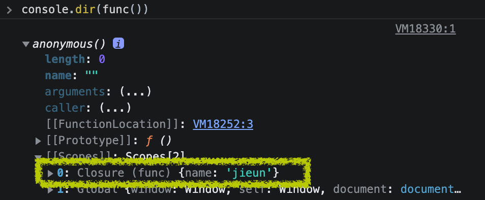

# 클로저 (Closure)

---

함수의 실행이 종료된 후에도 종료된 함수의 내부 함수를 통해 종료된 함수의 변수에 접근할 수 있는데, 이는 클로저가 생성됐기 때문에 가능한 일이다. 여기서 중요한 키포인트는 내부 함수가 `리턴 함수`여야 한다는 것!

## closure

```js
function func() {
  const name = "jieun";
  return () => console.log(name);
}

/**
 * 변수 me에 내부 함수가 반환되고
 * 함수 func()는 메모리에서 삭제된다.
 **/
const me = func();
me(); // jieun
```

함수 func()의 실행이 종료된 후에도 리턴된 내부 함수를 통해 지역 변수(name)에 접근이 가능하다. 즉, 클로저를 통해 실행이 종료된 외부 함수의 스코프에 접근을 할 수 있다는 뜻이다.

## lexical environment

함수 종료 시, 함수 정보가 담긴 객체인 **실행 컨텍스트**가 함수와 함께 종료된다. 그런데도 실행이 종료된 함수의 변수에 접근할 수 있는 이유는 함수 호출 시 실행 컨텍스트와 함께 `lexical environment가 생성`되기 때문이다.

Lexical Environment는 함수 내부의 정보와 상위 스코프의 정보가 정의되어 있다.

```js {4}
function func() {
  const name = "jieun";
  return () => console.log(name);
  // 함수 생성 시, 익명 함수의 lexcical environemnt에 함수 func()의 정보를 참조하고 있음
}
```

lexical environment는 클로저와 아주 밀접한 관계가 있다. MDN에서 클로저를 lexical environment의 조합이라고 정의하고 있다. 번역체라서 자연스럽진 않지만.. 이상하게도 이해가 된다. (lexical environment에 정의된 스코프로 묶여있는 객체라고 이해함)

콘솔 창에 **console.dir(func())** 를 입력하면 스코프 내에 클로저가 생성된 것을 확인할 수 있다.



## 클로저의 활용

클로저는 함수가 생성될 때 본인뿐 아니라 상위 스코프의 정보까지 가지고 있어야 하므로 MDN에서는 클로저가 불필요하게 사용되는 것은 처리 속도와 메모리 소비 측면에서 부정적인 영향을 끼친다고 한다. 그럼 어떤 상황에서 클로저를 사용하는 게 좋을까?

### 전역 변수 대체

전역 변수를 선언하지 않아도 클로저를 통해 `외부 함수의 변수를 전역 변수처럼 사용해서 값을 변경`할 수 있다.

아래는 버튼 클릭 횟수를 화면에 보여주는 소스이다. ① 외부 함수 counter()의 변수 count 값을 담고 있는 클로저가 변수 handleCounter에 저장되고 ② handleCounter()가 호출될 때마다 클로저에 저장된 count 값을 갱신한 후 리턴한다.

```js
// parameter는 함수의 지역변수로 사용됨!
// 함수 내에서 let count = 0; 으로 정의하는 것과 같다.
const counter = (count = 0) => (
  () => ++count;
);

const handleCounter = counter(); // ①
handleCounter(); // ②
```

<iframe height="300" style="width: 100%;" scrolling="no" title="Javascript Closure_ recycle" src="https://codepen.io/je0489/embed/MWvNvvG?default-tab=js%2Cresult" frameborder="no" loading="lazy" allowtransparency="true" allowfullscreen="true">
  See the Pen <a href="https://codepen.io/je0489/pen/MWvNvvG">
  Javascript Closure_ recycle</a> by jieun jang (<a href="https://codepen.io/je0489">@je0489</a>)
  on <a href="https://codepen.io">CodePen</a>.
</iframe>

### java의 프라이빗 메소드

자바스크립트는 별도의 private 키워드가 없지만, 클로저를 통해 java의 private method처럼 일부 접근을 제한할 수 있다. `클로저를 이용한 모듈 패턴`을 구현하여 함수가 아닌 객체로 감싸진 함수로 캡슐화해서 값을 리턴시킨다.

아래는 위 예제에 초기화 기능이 추가된 소스이다. 외부 함수 counter()의 내부 함수를 캡슐화하여 increase()와 reset() 함수를 정의했다. ① handleCounter.increase() 함수 호출 시 기존과 동일하게 count 값을 갱신한 후 리턴할 것이다. 그리고 ② handleCounter.reset()는 count 값을 0으로 변경시킨 후 리턴될 것이다.

```js
const counter = (count = 0) => {
  return {
    increase: () => ++count,
    reset: () => (count = 0),
  };
};
const handleCounter = counter();
handleCounter.increase(); // ①
handleCounter.reset(); // ②
```

<iframe height="300" style="width: 100%;" scrolling="no" title="CSS Closure_global-variable" src="https://codepen.io/je0489/embed/YzxmrGZ?default-tab=js%2Cresult" frameborder="no" loading="lazy" allowtransparency="true" allowfullscreen="true">
  See the Pen <a href="https://codepen.io/je0489/pen/YzxmrGZ">
  CSS Closure_global-variable</a> by jieun jang (<a href="https://codepen.io/je0489">@je0489</a>)
  on <a href="https://codepen.io">CodePen</a>.
</iframe>

> 활용 예제들이.. MDN을 참고해서 직접 생각하고 적용한 예제라.. 적절한지는 모르겠지만  
> 어떤 상황에서 쓰여야 되는지 알겠다.. 꾸준히 사용해 보고! 활용 예제가 적절하지 않은 것 같으면 변경해야겠다!

### Reference

- [MDN 공식 문서 - Closures](https://developer.mozilla.org/ko/docs/Web/JavaScript/Closures)
- 황준일님의 TIL [자바스크립트 실행 컨텍스트](https://junilhwang.github.io/TIL/Javascript/Domain/Execution-Context)
