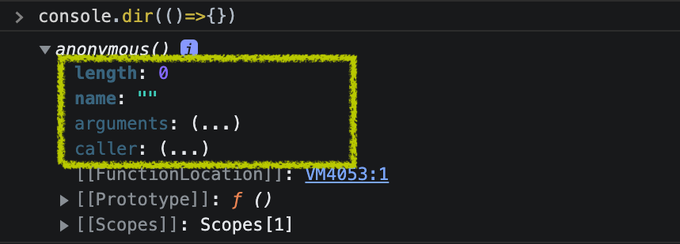
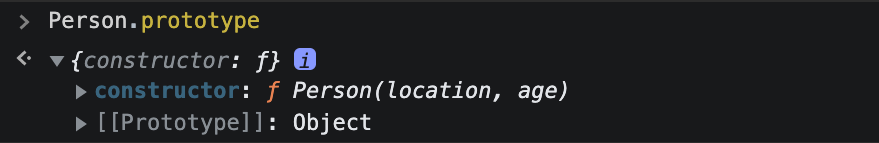
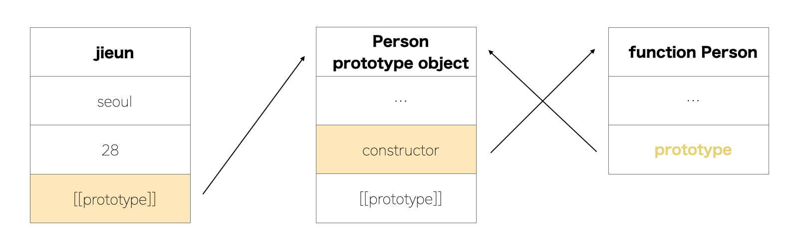

# Prototype

---

자바스크립트를 prototype 기반 언어라고 부르기도 하고 MDN에서도 많이 본 용어기도 하다. [Javascript의 this](./this.md) 글을 작성하면서 prototype이 의미하는 게 정확히 무엇인지 궁금해졌다.

## prototype이란

javascript의 모든 객체는 prototype 객체를 가지고 있다. 배열 생성 후 **console.dir(xx)** 로 확인해보면 \[\[Prototype\]\] 속성에 Array의 메소드가 참조된 것을 확인할 수 있다. prototype은 `본래의 성질`이라고 할 수 있을 것 같다.


Array뿐 아니라 `Function` 기반의 객체라면 본인만의 prototype을 가질 수 있다. Array도 Function 기반의 객체이기 때문에 prototype을 가지는 것이다. `즉, 모든 함수는 prototype이라는 속성을 자동적으로 가지게 된다.`


::: details 단, arrow func은 prototype 속성이 없다.
<br>



우연히 콘솔에 UDF의 dir를 찍어보다가 arrow function도 함께 찍어봤다.

화살표 함수의 속성엔 prototype이 없었다. 그 원인은 `constructor(생성자)`였다. 화살표 함수에는 몇 가지의 제한점이 있는데 그중 하나가 <sup>[1]</sup>생성자 함수에 대한 제한이다.

<div class="footnote">
    <sup>[1]</sup> 생성자 함수는 prototype 속성을 가지고 prototype object의 constructor를 사용한다. <a href="#prototype-object">prototype object</a>에 대한 설명은 아래에서 자세하게 한다!
</div>
:::

## prototype link와 prototype object

prototype은 prototype link와 prototype object로 나눌 수 있다.

    - prototype link = [[Prototype]] 속성
    - prototype object = constructor + [[Prototype]] 속성

### prototype link

prototype link는 위에서 말한 바와 같이 \[\[Prototype\]\] 속성을 뜻하고 본인의 `부모 객체를 가리킨다`. 배열을 생성했을 때 \[\[Prototype\]\] 속성에 Array의 메소드가 표시된 이유다. 구조를 그리면 아래와 같다.


### prototype object

constructor 속성과 prototype link인 \[\[Prototype\]\] 속성으로 구성되어 있고, `prototype 속성을 통해 접근할 수 있는 객체`이다. 함수를 생성하면 함수와 함께 prototype object가 자동으로 생성된다. 따라서, 이를 참조하는 prototype 속성도 생성되는 것이다.

예를 들어, 아래와 같이 Person 함수를 정의하는 경우 함수 객체와 함께 prototype 객체가 생성되고 아래와 같은 구조가 될 수 있다.

```javascript
function Person(location, age) {
  this.location = location;
  this.age = age;
}
```


constructor 속성은 본인 함수 객체를 가리키고 prototype 속성은 prototype 객체ㄱ를 가리킨다. prototype 객체와 함수 Person 객체는 constructor과 prototype 속성을 통해 서로 참조하는 관계이다!



new 키워드를 통해 Person 함수의 인스턴스를 만든 경우 prototype 구조는 아래처럼 된다.

```javascript
const jieun = new Person("seoul", 28);
```



- jieun의 \[\[prototype\]\]: jieun의 부모 객체인 Person prototype 속성. 즉, prototype 속성이 가리키는 Person prototype 객체.
- Person prorotype 객체
  1. constructor: 함수 Person을 가리킴
  2. \[\[prototype\]\]: <sup>[2]</sup>Function의 부모 객체는 Object. 즉, Object prototype 객체를 가리킴
- 함수 Person 객체의 prototype: Person prototype 객체를 가리킴

<div class="footnote">
    <sup>[2]</sup> 모든 객체의 조상은 Object이다. 즉, 모든 객체는 Object의 자식임
</div>

## prototype chain

배열 생성 후 map(), sort() 등 Array의 함수를 사용할 수 있는 이유도 prototype chain 구조 때문이다. prototype link를 통해 상위 prototype object에 접근하는 방식을 프로토타입 체인이라고 한다.

어떤 property를 요청했을 경우, 본인 property부터 상위 프로토타입 순으로 탐색을 시작한다. <sup>[3]</sup>**최상위 프로토타입 객체인 Object prototype object**에 도달했는데도 못 찾을 경우 <u>undefined</u>를 리턴한다.

<div class="footnote">
    <sup>[3]</sup> 이를 prototype chain의 종점이라고 함
</div>

### Reference

- MDN 공식 문서
  1. [Object prototypes](https://developer.mozilla.org/ko/docs/Learn/JavaScript/Objects/Object_prototypes)
  2. [상속과 프로토타입](https://developer.mozilla.org/ko/docs/Web/JavaScript/Inheritance_and_the_prototype_chain)
- 오승환님의 [\[Javascript\] 프로토타입 이해하기](https://medium.com/@bluesh55/javascript-prototype-%EC%9D%B4%ED%95%B4%ED%95%98%EA%B8%B0-f8e67c286b67)
- WANZA님의 [\[Javascript\] 프로토타입(prototype) 뽀개기](https://blog.wanzargen.me/35)
