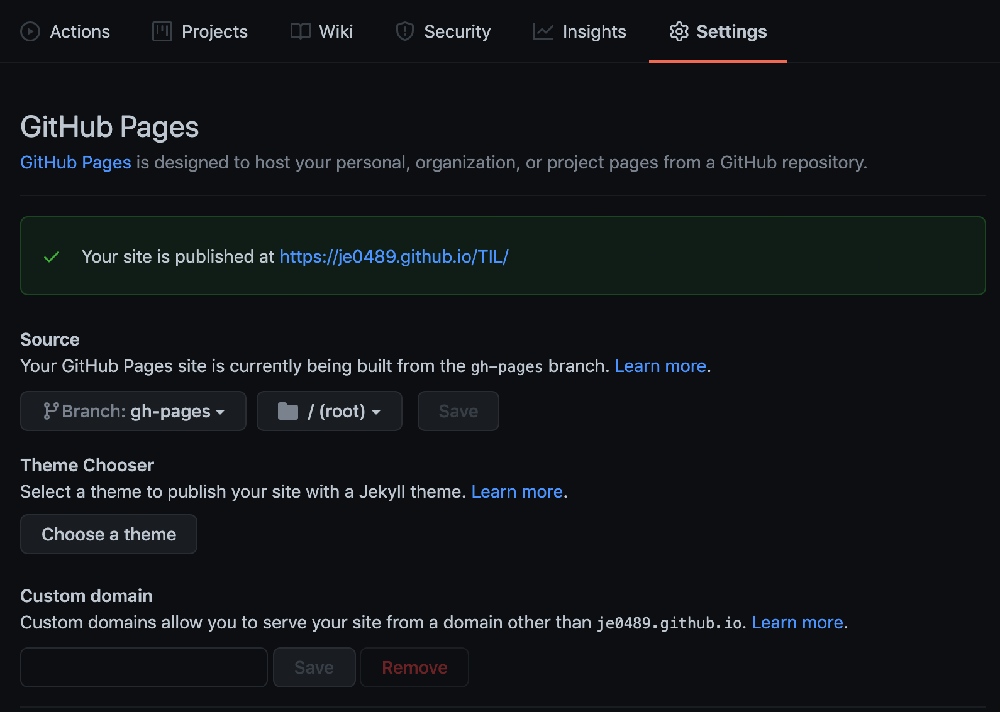

# Github에 배포하기

<hr>

Github의 pages 기능을 이용해 웹 호스팅하며 남긴 기록이다. 새 브랜치를 따서 저장소에 올렸는데 그 과정이 개념적으로 이해되지 않아 생각보다 오랜 시간이 걸렸다.

## 1. 브랜치 생성

VSCode에 깃허브를 연동해 사용 중이라 VSCode 내에서 `gh-pages`라는 새 브랜치를 생성했다. 또는 아래의 명령어를 통해 새 브랜치를 생성하면 된다.

```sh
git branch gh-pages
```

## 2. build 폴더 지정

vuePress의 config.js 내에서 `dest` 값을 통해 build의 output 디렉토리를 지정할 수 있다. 필자는 별도의 폴더를 지정해주었다. (dest 값 미기재시 `.vuepress/dist`에 빌드됨)

```json {4}
// .vuepress/config.js
module.exports = {
// .. 생략
  dest: "build",
  themeConfig: {
    sidebarDepth: 3,
// 생략 ..
```

## 3. 배포하기

생성한 브랜치로 checkout 후 아래의 명령어를 입력하면 build된 폴더만 ph-pages 브랜치에 push된다. 자주 사용하는 명령어는 package.json의 scripts로 기재해 사용 중이다!

```sh
vuepress build documents && git add build && git commit -m 'Build: Deploy'
git subtree push --prefix build https://github.com/je0489/TIL.git gh-pages
```

```json {5-6}
// package.json
  "scripts": {
    "dev": "vuepress dev documents",
    "build": "vuepress build documents",
    "commit": "vuepress build documents && git add build && git commit -m 'Build: Deploy'",
    "deploy": "git subtree push --prefix build https://github.com/je0489/TIL.git gh-pages",
    "gh-pull": "git pull origin master",
    "eject": "vuepress eject"
  },
```

## 4. Reposit pages 설정

Github의 웹호스팅할 저장소 홈페이지로 들어가 `Settings > pages`에서 브랜치와 루트를 아래와 같이 설정해주면 끝~~~!



### Reference

- [공식 문서 config(dest)](https://vuepress.vuejs.org/config/#dest)
- [github 특정폴더만 배포시키기(subtree)](https://www.imkh.dev/github-pages-subtree/)
