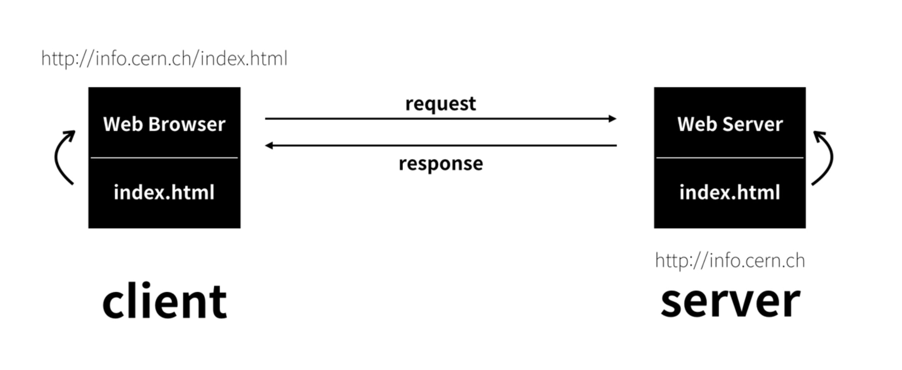

# Web이란

---

Web은 인터넷으로 연결된 사용자 간 정보를 공유하는 서비스로, 정보는 **web browser**를 통해 확인할 수 있다.

## Internet

인터넷은 TCP/IP 기반의 네트워크가 세계적으로 연결된 네트워크이고 웹은 `그 인터넷을 통해 제공되는 서비스의 일종`이다. (그 외로 이메일, FTP(파일 공유) 등 다양한 서비스가 있음)

## 웹 동작 원리

간단하게 말하자면, `인터넷으로 연결된 두 대의 컴퓨터(host)가 정보를 주고 받는 것`이다. Web browser(client)가 Web server(server)에 접근을 요청하면 웹 페이지의 사본을 전송한다.

- 구체적인 동작 순서는 아래와 같다.

  1. 웹 브라우저에서 검색창에 주소를 입력한다.
  2. 웹 브라우저가 [DNS](#dns-domain-name-system) 서버에게 주소(도메인)를 요청한다.
  3. DNS가 웹 브라우저에게 서버의 IP 주소를 보낸다.
  4. 웹 브라우저가 IP 주소의 주인인 서버에게 [HTTP 요청 메세지](#http-메세지)를 [1]전송한다.
  5. 웹 서버는 웹 브라우저에게 [2]HTTP 상태 코드와 웹 사이트의 파일을 HTTP 응답 메세지로 전송한다.
  6. 웹 브라우저는 전달받은 메세지를 변환한 후 웹 페이지를 출력한다.

  

    [1] 모든 데이터는 TCP/IP 통신을 통해 전송됨 
    [2] 1xx: 정보, 2xx: 성공, 3xx: 리다이렉션, 4xx: 클라이언트(요청) 오류, 5xx: 서버 오류
  

### DNS(Domain Name System)

전화번호부라고 생각하면 이해하기 쉬울 것 같다. Host 간의 통신을 위해서는 서로의 [3]IP 주소가 반드시 필요한데 Domain Name System이 그 `IP 주소와 도메인 명을 관리`한다. DNS를 통해 전달받은 IP 주소로 호스트끼리 연결해서 통신을 할 수 있는 것이다!

DNS 서버의 IP 주소는 각 운영체제에 저장돼있다. 이는 제어판 등에서 확인할 수 있고 [4]사용 중인 인터넷 서비스 업체의 DNS IP 주소가 기본적으로 셋팅되어 있다.

    [3] x.x.x.x 형식의 인터넷 고유 주소를 의미함 
    [4] 다른 public DNS로 변경 가능함 

::: details DNS이 등장하기 전에는..
Standford Research Insitute라는 단체가 전 세계의 [5]hosts 파일을 수기로 관리하며 사용자가 갱신된 hosts 파일을 다운로드하는 방식으로 운영됐다. 이런 방식은 아래와 같은 문제점이 있었다.

1. 단체 내에서 수기로 관리하므로 파일 갱신에 많은 시간과 비용 발생
2. 사용자가 파일을 다운로드하기 전까진 갱신된 도메인을 이용할 수 없음
3. 파일 내에 저장된 데이터양이 많아질수록 관리가 힘들어짐

    [5] 현재도 hosts 파일로 도메인과 IP를 관리할 수 있음! 
    &nbsp;&nbsp;&nbsp;&nbsp; DNS보다 도메인에 대한 우선권을 가지게 되고 모든 OS에 hosts라는 파일이 존재함 
    &nbsp;&nbsp;&nbsp;&nbsp; (Mac의 경우, /etc 내에 위치 ➲ <strong>x.x.x.x _.com</strong> 형식으로 관리)

   :::

### HTTP 메세지

HTTP(HyperText Transfer Protocol)는 웹 페이지 전송을 위한 통신 규약으로, `HTTP 통신을 통해 메세지가 생성`된다. Request와 Response 메세지로 구성되어 있고 HTTP [6]패킷이라고도 한다.

HTTP 패킷은 크게 Header와 Body로 나뉜다. 이는 개발자도구의 Network 탭에서 확인할 수 있다.

    [6] 네트워크를 통해 전송되는 데이터 

### Reference

- [MDN 문서 - How the web works](https://developer.mozilla.org/ko/docs/Learn/Getting_started_with_the_web/How_the_Web_works)
- Youtube egoing님
  1. [생활코딩 WEB1- HTML & Internet](https://youtu.be/tZooW6PritE)
  2. [생활코딩 WEB2-Domain Name System](https://youtu.be/zrqivQVj3JM)
